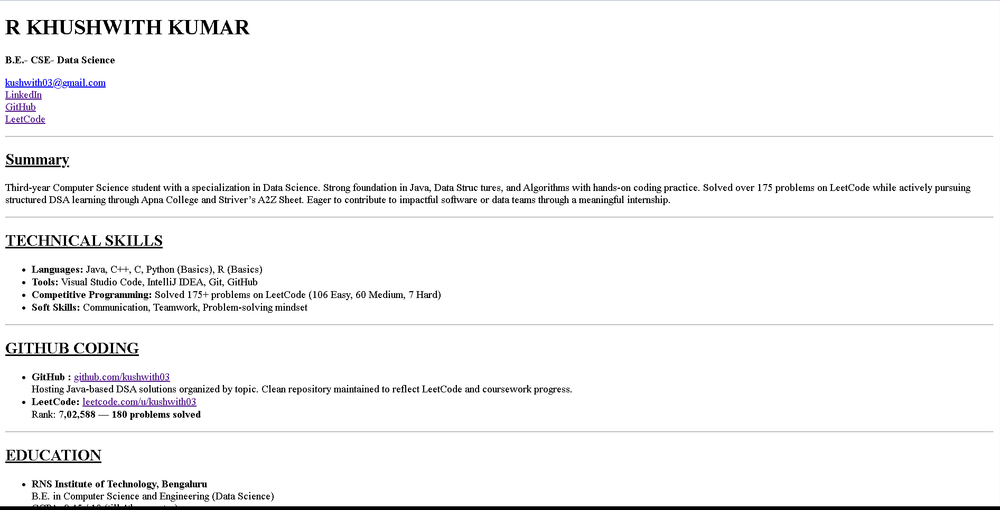

# 🧾 Online Resume – HTML Version

This project is a **simple online resume** created using only **HTML**. It serves as a personal portfolio to showcase my skills, education, and background. This is one of my early web development projects, built as I continue my journey into frontend development.

🌐 **Live Preview**: [View Resume](https://kushwith03.github.io/online-resume/)  
📸 **Preview Screenshot**:  


---
## 📚 About This Project

- A fully static resume built with basic semantic HTML
- Shows structured personal information, skills, education, and contact links
- No CSS or JS – focused purely on practicing HTML formatting

---

## 🧠 Key Features

- Clean structure using HTML5 semantic tags (`<header>`, `<main>`, `<section>`, `<footer>`)
- Contact links (Email, GitHub, LinkedIn, LeetCode)
- Includes education history, certifications, skills, and hobbies
- Easily expandable with CSS and interactivity in the future

---

## 📁 Folder Structure

```
online-resume/
├── index.html # Main HTML file
├── preview.png # Screenshot for README preview
└── README.md # Project description
```

---

## 🚀 What's Next?

- ✅ Host on GitHub Pages  
- 🔜 Add custom CSS for styling and layout  
- 🔜 Make it responsive for mobile and tablets  
- 🔜 Add downloadable PDF resume link  
- 🔜 Improve accessibility (alt text, ARIA labels)  
- 🔜 Use Bootstrap for better design structure  

---

## 📬 Contact Me

- 📧 Email: [kushwith03@gmail.com](mailto:kushwith03@gmail.com)  
- 💼 [LinkedIn](https://www.linkedin.com/in/kushwith03)  
- 🐙 [GitHub](https://github.com/kushwith03)  
- 🧠 [LeetCode](https://leetcode.com/u/kushwith_03)

---

> 💡 This resume is a reflection of my ongoing progress in web development. I’m continuously learning and will update this as I grow in skills and experience.

